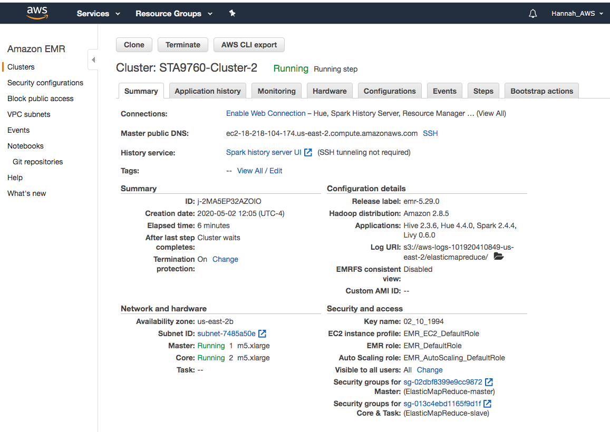

# YelpReviews
Analyzing 10Gb of Yelp Reviews Data

Use PySpark on AWS EMR to analyze 10Gb of Yelp review data. Yelp review data is sourced from Kaggle in json format and transfered to an S3 bucket for analysis in the application. I look at some descriptive properties of the review data and analyze whether reviews tend to be optimistic or pessimistic. 

### Cluster Configuration

